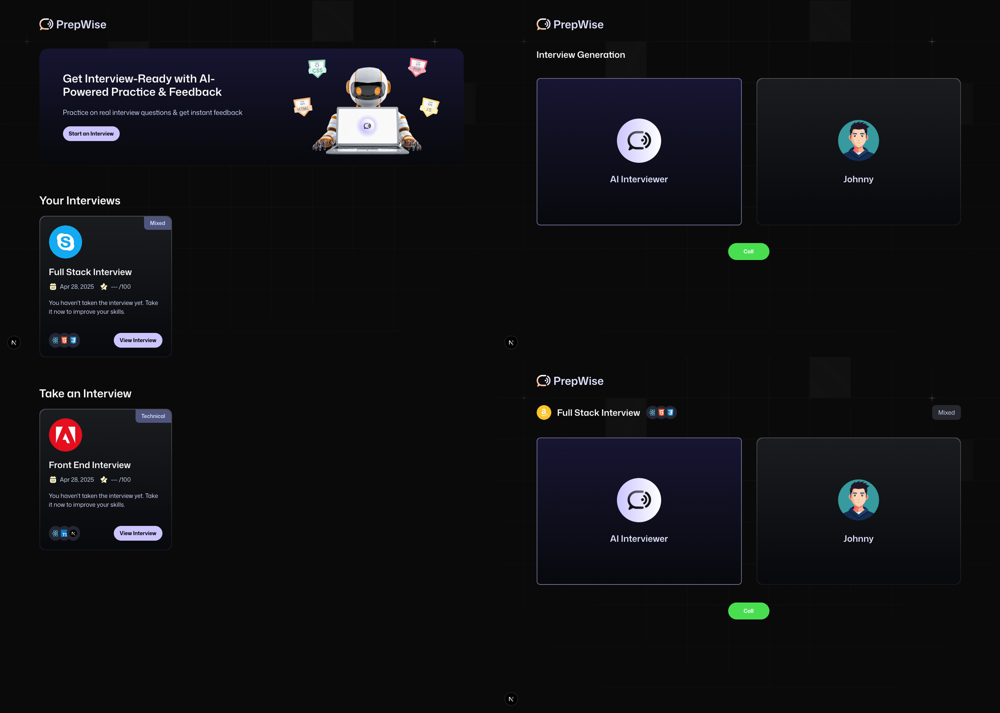

<div align="center">

# 🤖 PrepWise — AI-Powered Mock Interview Platform

Simulate real job interviews using AI voice, get instant feedback, and sharpen your tech skills — all in one place.

</div>

---

<div align="center">

### 🛠 Built With

[](https://nextjs.org/)
[](https://firebase.google.com/)
[](https://tailwindcss.com/)
[](https://www.typescriptlang.org/)
[](https://vercel.com/)
[](https://ai.google.dev/)
[](https://www.vapi.ai/)

## </div>

---

## 🧠 Overview

**PrepWise** is a fully responsive and interactive AI-powered **mock interview web app**.  
It features real-time voice-based interview simulations, automatic feedback generation, user dashboards, and custom interview setups — all structured with a clean, scalable, and maintainable codebase.

Inspired by [JavaScript Mastery](https://www.youtube.com/@javascriptmastery),  
this project is ideal for **developers and tech job seekers** who want to **practice interview skills, enhance their technical readiness, and experience AI-driven mock interviews**.

---

## 📸 Demo



---

## 🌐 Live Demo

[](https://ai-agent-interviews.vercel.app/)

---

### 🔍 Highlights

- ✅ Real-time AI voice conversation flow with Vapi
- ✅ Smart feedback generation using Google Gemini AI
- ✅ Customizable interviews based on role, level, tech stack, and type
- ✅ Reusable and scalable UI components built with TailwindCSS
- ✅ Secure session authentication with Firebase
- ✅ User dashboard displaying interview history and feedback
- ✅ Fully responsive, production-ready deployment via Vercel

---

## 🚀 Features

- 🎙️ AI-powered voice-based interview simulation via Vapi
- 🧩 Supports both technical and behavioral interview types
- 📊 Real-time feedback generation using Gemini (Google AI)
- 📁 Dynamic interview creation with custom tech stacks
- 🗂️ Dashboard with past interview results and feedback
- 🔒 Secure authentication with Firebase
- 🌐 Deployed on Vercel

---

## ⚙️ Tech Stack

- **Frontend:** Next.js (App Router), TypeScript, TailwindCSS
- **Backend:** Firebase Admin SDK, Firestore
- **Authentication:** Firebase Auth (Session Cookies)
- **AI Engine:** Gemini via `ai-sdk` from Google
- **Voice API:** Vapi
- **Deployment:** Vercel

---

## 📂 Project Structure

```
interview_platform/
├── app/                  # App routes (Next.js)
├── components/           # Reusable UI + logic components
├── constants/            # Mappings, dummy data, feedback schema
├── firebase/             # Firebase admin and client setup
├── lib/                  # Utilities, Vapi setup, server actions
├── public/               # Static assets
├── styles/               # Global CSS (Tailwind)
├── types/                # Global TypeScript types
├── .env.example          # Sample environment variables
├── README.md             # Project documentation
```

---

## 🛠️ Getting Started

### 1. Clone the project

```bash
git clone https://github.com/Oran01/AI-Agent-Interviews.git
cd AI-Agent-Interviews
```

### 2. Install dependencies

```bash
npm install
# or
yarn install
```

### 3. Configure environment variables

Copy `.env.example` to `.env.local` and fill in your Firebase, Gemini, and Vapi credentials:

```bash
cp .env.example .env.local
```

### 4. Run the development server

```bash
npm run dev
# or
yarn dev
```

Visit [http://localhost:3000](http://localhost:3000) in your browser.

---

## 📦 Deployment

Deploy the project instantly with Vercel:

[](https://vercel.com/new)

Make sure to set your environment variables in the Vercel dashboard.

---

## ▶️ Tutorial Followed

This project was built following the amazing JavaScript Mastery tutorial:  
[Build and Deploy a Full Stack Real Time AI Voice Agent Interview Platform](https://www.youtube.com/watch?v=8GK8R77Bd7g)

---

## 🤝 Contributing

Feel free to fork this repository and submit pull requests to improve the project!

⭐ If you enjoyed this project, please consider giving it a star!
